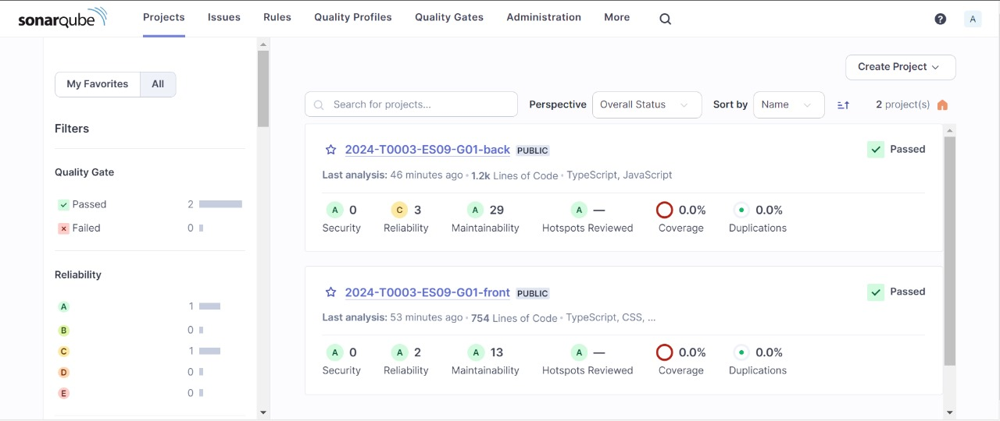
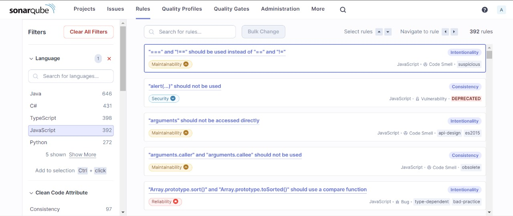
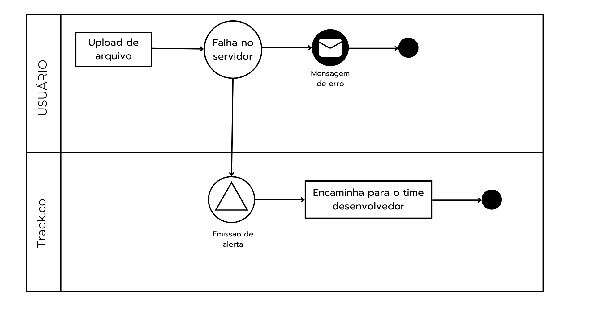

# Documentação oficial do projeto

# Documentação oficial do projeto

 &  

 
 

---

|Sumário|
|-----------|
| [Introdução](#introdução)  |
| [Definição dos Requisitos Não Funcionais](#definição-dos-requisitos-não-funcionais)| 
| [Definição dos Requisitos Funcionais](#definição-dos-requisitos-funcionais) |
| [Diagrama Nível 1 C4 Model - Contexto ](#diagrama-nível-1-c4-model---contexto)|
| [Diagrama Nível 2 C4 Model - Container](#diagrama-nível-2-c4-model---contêiner) |
| [Prototipação do front-end](#prototipação-do-front-end) |
| [Implementação e Práticas de Segurança do front-end](#implementação-e-práticas-de-segurança-do-front-end) |
|[Plano de Sustentação](#plano-de-sustentação)|

 

### Histórico de lançamento
---

| Versionamento | Data       |
| ----------------------- | ---------- |
| Versão 1                | 18/02/2024 |
| Versão 2                | 01/03/2024 |
| Versão 3                | 15/03/2024 |
| Versão 4                | 29/03/2024 |
| Versão 5                | 11/04/2024  |

---

 
 

# Introdução

O problema abordado no projeto é a necessidade de estabelecer uma estratégia abrangente para testes automatizados nas funcionalidades principais da plataforma CXM. Atualmente, a ausência de testes automatizados cria uma dependência significativa de testes manuais, tornando as implantações um processo crítico e propenso a erros. Isso não apenas afeta a percepção de confiabilidade da plataforma entre os clientes, mas também aumenta o risco de perdas financeiras para a empresa. Cada reversão não apenas interrompe os serviços fornecidos, mas também aumenta a probabilidade de insatisfação do cliente e possível migração para concorrentes mais estáveis.

O objetivo é implementar testes automatizados nessas funcionalidades críticas para reduzir a probabilidade de regressões durante as implantações e permitir a detecção precoce de possíveis problemas. Ao fazer isso, será melhorada significativamente a confiança do cliente, pois a plataforma será percebida como mais robusta e confiável. Para abordar esse problema de forma eficaz, deve-se concentrar nas funcionalidades principais, especificamente Pesquisas, Dashboards, Distribuição e Interação, pois essas telas desempenham um papel central na plataforma.

Os benefícios esperados para o parceiro, TRACK.CO, incluem maior estabilidade e confiabilidade da plataforma, com uma redução significativa de reversões. Isso, por sua vez, aumentará a confiança do cliente, levando à retenção dos mesmos e atraindo novos. Além disso, os testes automatizados economizarão tempo e recursos, permitindo uma abordagem de desenvolvimento mais ágil. A detecção precoce de problemas será facilitada, melhorando a qualidade geral do software. No longo prazo, a redução de erros e reversões resultará em economia de custos. Em geral, a implementação de testes automatizados é crucial para fortalecer a posição da empresa, melhorar sua reputação e garantir o sucesso contínuo no mercado.

# Seleção dos casos de uso

O parceiro apresentou diversos casos de uso para o MVP do projeto, O parceiro apresentou uma variedade de casos de uso para o MVP do projeto, todos baseados em situações reais de utilização da plataforma, levando em consideração suas funcionalidades e características de comportamento. É importante ressaltar que os casos de uso foram detalhadamente descritos e organizados como opções de escolha, incluindo:

- **Caso de uso 1:** Realizar distribuição com o canal  E-mail e verificar os retornos associados.
- **Caso de uso 2:**  Efetuar distribuição utilizando o canal do Whatsapp e analisar os resultados obtidos.
- **Caso de uso 3:** Executar distribuição por meio do canal SMS Link e avaliar os retornos recebidos.
- **Caso de uso 4:**  Conduzir distribuição via Lista de Links e examinar os resultados gerados.
- **Caso de uso 5:**  Configurar e implantar o widget de pesquisa em um domínio específico, verificando se as respostas foram devidamente registradas.
- **Caso de uso 6:** Verificar o quadrante de NPS Relacional, validando todas as zonas correspondentes.
- **Caso de uso 7:**  Criar um dashboard, adicionar o elemento NPS e comparar com os resultados do elemento NPS na tela de overview.
- **Caso de uso 8:** Aplicar filtros na tela de interações e verificar os resultados obtidos.
- **Caso de uso 9:**  Verificar o cadastro de clientes e sua saúde após o envio de uma planilha.
- **Caso de uso 10:** Criar um grupo de loop incluindo apenas interações que estejam em conformidade com o filtro aplicado e analisar as respostas correspondentes.

Para a execução do projeto, o grupo desenvolvedor optou por realizar os casos de uso 1 e 4, somado a um aditivo do caso de uso 9.  Isso se deve ao entendimento de que esta extensão é uma regra de negócio crucial para o desenvolvimento e execução plena do caso de uso 4.

# Definição dos Requisitos Não Funcionais

Requisitos não funcionais são critérios que definem as características e restrições do sistema, indo além das funcionalidades específicas que ele deve fornecer. Ao contrário dos requisitos funcionais, que se concentram no "o que" o sistema deve fazer, os requisitos não funcionais se concentram no "como" o sistema deve ser implementado, ou seja, nas qualidades e propriedades que ele deve possuir.

Os requisitos não funcionais abrangem uma ampla gama de aspectos, que podem incluir desempenho, segurança, usabilidade, confiabilidade, escalabilidade, manutenibilidade, interoperabilidade, entre outros. Eles fornecem critérios essenciais para avaliar a qualidade geral do sistema e garantir que ele atenda aos padrões e expectativas definidos pelos usuários e pelo ambiente em que será implantado.

### RNF01 - O sistema deve garantir o disparo de até 1000 pesquisas em no máximo 2 segundos. 

O requisito especifica que o sistema precisa ser capaz de enviar um máximo de 1000 pesquisas em um período de tempo de no máximo 2 segundos. Isso implica que o sistema deve ser capaz de processar e enviar uma grande quantidade de pesquisas de forma rápida e eficiente.

Para atender a esse requisito, o sistema exigirá uma infraestrutura robusta e escalável, além de um mecanismo de envio de pesquisas de satisfação eficiente. Pode ser necessário implementar técnicas de otimização, como processamento paralelo, para garantir que as pesquisas sejam enviados dentro do limite de tempo especificado.

### RNF02 - O sistema deve ter nível de disponibilidade de 95%.

O sistema deve garantir um nível de disponibilidade mínimo de 95%. Isso significa que o sistema deve estar acessível e operacional para os usuários durante pelo menos 95% do tempo, considerando um período de avaliação específico.
Para atender a esse requisito, o sistema deve ser projetado e implementado com mecanismos de alta disponibilidade. Isso inclui a utilização de infraestrutura redundante, balanceamento de carga e replicação de dados para evitar pontos únicos de falha e garantir a resiliência do sistema.

É importante considerar a monitoração constante do sistema, a fim de identificar e responder rapidamente a possíveis incidentes ou falhas que possam afetar a disponibilidade.

### RNF03 - O sistema deve garantir a segurança dos dados dos usuários e também dos clientes de seus usuários, não permitindo o uso de informações sensíveis (número de telefone, email ou outros dados de contato usados pela plataforma).

O sistema deve garantir a segurança dos dados dos usuários e dos clientes, protegendo as informações sensíveis, como números de telefone, e-mails e outros dados de contato utilizados pela plataforma. Essa medida visa a preservar a privacidade e a confidencialidade das informações, evitando o uso indevido ou não autorizado desses dados.

Para atender a esse requisito, o sistema deve adotar medidas de segurança adequadas, considerando práticas recomendadas e padrões amplamente reconhecidos, como:

- Criptografia;
- Controle de acesso;
- Proteção contra ataques;
- Políticas de privacidade;
- Treinamento e conscientização.

### RNF04 - O sistema deve ter taxa de atualização de até 5min dos dados coletados das pesquisas enviadas.

O sistema deve ser capaz de atualizar os dados coletados das pesquisas enviadas com uma taxa de atualização máxima de até 5 minutos. Isso significa que, após a coleta das respostas, as informações devem ser processadas e refletidas no sistema dentro desse intervalo de tempo.

A taxa de atualização rápida dos dados coletados é essencial para fornecer aos usuários uma visão em tempo quase real do feedback dos clientes. Com uma atualização frequente, os usuários podem acompanhar as respostas e as métricas de desempenho atualizadas, permitindo uma tomada de decisão ágil e informada.

Para atender a esse requisito, o sistema deve ser projetado e otimizado para processar e armazenar eficientemente as respostas das pesquisas.

### RNF05 - O sistema deve ter uma alta manutenabilidade, permitindo a atualização e correção da plataforma.

O sistema deve ser projetado e desenvolvido com alta manutenabilidade, permitindo atualizações, correções e melhorias contínuas na plataforma. Isso é fundamental para garantir a estabilidade, confiabilidade e eficiência do sistema ao longo do tempo, bem como para atender às necessidades em evolução dos usuários e do ambiente operacional.

Para isso, serão considerados os mecanismos:

- Modularidade;
- Documentação abrangente;
- Boas Práticas de desenvolvimento;
- Versionamento de código;
- Testes automatizados;
- Processo de liberação e implantação;
- Monitoramento e métricas.

### RNF06 - A plataforma deve ser compatível principalmente com desktops, porém as pesquisas devem se adaptar para diferentes dispositivos e ambientes (como o e-mail, WhatsApp e outros).

A plataforma deve ser compatível principalmente com desktops, garantindo uma experiência otimizada nesses dispositivos. No entanto, as pesquisas realizadas na plataforma devem se adaptar para diferentes dispositivos e ambientes, incluindo dispositivos móveis, como smartphones e tablets, e aplicativos de mensagens, como o WhatsApp, e-mail e outros.

Para atender a esse requisito, serão consideradas as seguintes diretrizes e práticas:

- Responsividade;
- Design Mobile-Friendly;
- Suporte a navegadores;
- Integração com apps de mensagens;
- Testes em diferentes dispositivos;
- Acessibilidade.

### RNF07 - O sistema deve ser tolerante a falhas, tendo mecanismos para lidar ou conter erros durante o seu funcionamento.

O sistema deve ser projetado e implementado com mecanismos que permitam lidar de forma eficiente com falhas e erros que possam ocorrer durante o seu funcionamento. Esses mecanismos garantem a estabilidade e a continuidade das operações, minimizando interrupções e impactos negativos.

Para atender a esse requisito, é necessário considerar as seguintes diretrizes e práticas:

- Detecção de falhas;
- Recuperação automática;
- Tolerância a falhas de componentes;
- Isolamento e contenção de erros;
- Monitoramento e registro de falhas;
  Testes de resiliência.

### RNF08 - A interface do sistema deve ser intuitiva a fim de permitir reduzir a curva de aprendizado para novos usuários.

Para garantir a adoção e a satisfação dos usuários, o sistema deve oferecer uma interface intuitiva e amigável, seguindo a identidade visual da Track. Isso inclui o design de uma interface de usuário clara, com navegação simplificada, elementos de controle bem definidos e feedback visual adequado para orientar os usuários durante suas interações.

Uma interface intuitiva reduzirá a curva de aprendizado para novos usuários, aumentando a eficiência e a produtividade geral do sistema.

### RNF09 - O sistema deve ter o consentimento e transparência para com o usuario em relação ao uso dos seus dados.

O sistema deve obter o consentimento explícito dos usuários para coletar, processar e armazenar seus dados pessoais, garantindo a clara divulgação dos fins para os quais os dados serão utilizados e a possibilidade de revogação do consentimento a qualquer momento. Além disso, deve fornecer aos usuários informações claras e transparentes sobre suas práticas de tratamento de dados pessoais, incluindo políticas de privacidade, termos de uso e procedimentos para exercer os direitos dos titulares dos dados. O sistema também deve manter registros internos de suas atividades de tratamento de dados e estar preparado para demonstrar conformidade com os requisitos da LGPD.

### RNF10 - O sistema deve garantir uma escalabilidade horizontal para lidar com aumentos repentinos no volume de usuários e dados.

O sistema deve ser capaz de dimensionar horizontalmente seus recursos para lidar com picos de demanda repentinos, tanto em termos de número de usuários quanto de volume de dados. Isso significa que a arquitetura do sistema deve permitir a adição de novas instâncias de servidores de forma dinâmica e automatizada, distribuindo a carga de trabalho de maneira equilibrada e garantindo o desempenho adequado do sistema mesmo em momentos de alta atividade.

Para atender a esse requisito, serão consideradas técnicas como:

- Balanceamento de carga automático;
- Arquitetura de microsserviços;
- Uso de contêineres e orquestração de contêineres;
- Escalonamento automático baseado em métricas de utilização;
- Gerenciamento eficiente de recursos e capacidade de adaptação.

## Definição dos Requisitos Funcionais, descrição dos Fluxos Principais, dos Fluxos de Exceção e dos Fluxos Alternativos.

Requisitos funcionais são descrições detalhadas das funcionalidades e comportamentos que um sistema ou software deve possuir para atender às necessidades dos usuários. Eles especificam o que o sistema deve fazer, quais tarefas ele deve realizar e como ele deve se comportar em diferentes situações.

Os requisitos funcionais descrevem as principais funções, operações e serviços que são necessários para o sistema atingir seus objetivos. Eles geralmente são expressos em termos de entradas, saídas e comportamentos esperados. Esses requisitos podem incluir tarefas como processar informações, executar cálculos, exibir dados, interagir com usuários ou outros sistemas, entre outras funcionalidades.

Sabe-se que foram selecionados dois casos de uso para a execução e prototipação. Assim, definiu-se 4 requisitos principais de cada, como requisitos norteadores do desenvolvimento.

Ademais, fluxos de exceção são conjuntos de condições ou eventos não previstos que podem ocorrer durante a operação de um sistema ou software, necessitando de tratamento específico para manter a funcionalidade e a estabilidade do sistema. Eles representam os cenários onde as operações padrão desviam de seu curso normal, exigindo ações corretivas para lidar com entradas inválidas, falhas de comunicação, erros de processamento ou qualquer outro comportamento atípico.

Os fluxos de exceção detalham como o sistema deve responder a essas situações inesperadas, garantindo que possa se recuperar de falhas, informar os usuários sobre problemas e continuar operando de maneira eficiente. Eles são essenciais para a criação de sistemas robustos, confiáveis e seguros, que possam lidar com a complexidade e a incerteza do mundo real.

Estes fluxos descrevem as medidas preventivas, as mensagens de erro, as opções de recuperação de falhas e outras ações que o sistema deve tomar quando confrontado com uma exceção. Isso pode incluir, por exemplo, a validação de dados de entrada, a gestão de timeouts de conexão, a manipulação de erros de terceiros, entre outras estratégias de resolução de problemas.

Enquanto, um fluxo alternativo é uma sequência de etapas ou ações que ocorrem em um processo de software quando certas condições são atendidas ou quando ocorrem eventos específicos. Esses fluxos alternativos são usados para lidar com situações excepcionais, condições de erro ou requisitos não funcionais.

Ao definir requisitos, os fluxos alternativos são considerados para capturar os comportamentos não triviais do sistema e garantir que todas as possíveis situações sejam abordadas. Os fluxos alternativos são frequentemente documentados em conjunto com o fluxo principal ou fluxo normal do sistema.

## Caso de uso 1

### RF01 - O sistema deve permitir o disparo de pesquisas por e-mail.

O requisito RF01 estabelece que o sistema deve ter a capacidade de enviar pesquisas de satisfação por e-mail. Esse requisito implica que o sistema deve suportar a funcionalidade de criação, agendamento, envio e acompanhamento de pesquisas de satisfação aos destinatários por meio do canal de comunicação por e-mail.

Para atender a esse requisito, o sistema precisará fornecer uma interface onde os usuários possam criar e personalizar as pesquisas de satisfação. Isso pode incluir a definição de perguntas, opções de resposta, formatação de texto e design visual. Além disso, o sistema deve permitir que os usuários especifiquem os destinatários da pesquisa, seja por meio de listas de e-mails pré-definidas ou por meio de seleção manual.

### RF03 - O sistema deve emitir alerta de quando o disparo das pesquisas não for efetuado ou ocorrer algum erro.

O sistema deve ser capaz de emitir alertas automáticos quando o disparo das pesquisas de satisfação não for efetuado corretamente ou ocorrer algum erro durante o processo. Esses alertas são essenciais para garantir a integridade e a eficácia do sistema, permitindo que os usuários ajam prontamente para corrigir possíveis problemas.

O sistema deve monitorar de forma contínua e proativa o processo de disparo das pesquisas, verificando se todas as etapas ocorreram conforme o planejado.

### RF04 - O usuário deve conseguir receber os resultados das pesquisas enviadas por email e visualizar em um dashboard.

Para atender a esse requisito, o sistema precisa ser capaz de receber as respostas das pesquisas enviadas por e-mail. Isso pode envolver a integração com o serviço de envio de e-mails utilizado para coletar as respostas, a extração dos dados relevantes dos e-mails recebidos e o armazenamento desses dados em um formato adequado para análise posterior.

Além disso, o sistema deve fornecer um painel de controle (dashboard) onde o usuário possa visualizar os resultados das pesquisas de forma clara e intuitiva. Isso pode incluir gráficos, tabelas e outros elementos visuais que permitam ao usuário compreender e analisar os dados coletados. O painel de controle deve ser projetado de maneira a facilitar a identificação de tendências, insights e métricas relevantes relacionadas à satisfação dos clientes.

### Descrição do fluxo principal do caso de uso 1

1. **Criação da pesquisa de satisfação:** O usuário cria a pesquisa de satisfação, definindo as perguntas, opções de resposta e o design visual.
2. **Seleção de destinatários:** O usuário seleciona os destinatários da pesquisa, podendo ser uma lista de e-mails pré-definida, uma segmentação específica de contatos ou até mesmo uma seleção manual dos destinatários.
3. **Personalização do e-mail:** O usuário personaliza o e-mail que acompanhará a pesquisa de satisfação, incluindo uma saudação, mensagem introdutória e o link exclusivo para cada destinatário.
4. **Agendamento do envio:** O usuário agenda o momento adequado para o envio dos e-mails com as pesquisas de satisfação.
5. **Envio dos e-mails:** O sistema envia automaticamente os e-mails com as pesquisas de satisfação para os destinatários, utilizando as configurações e personalizações definidas pelo usuário.
6. **Acompanhamento e registro de respostas:** O sistema registra as respostas dos destinatários e fornece um mecanismo para o usuário acompanhar e analisar os resultados da pesquisa.

### Descrição do fluxo de exceção do caso de uso 1

- **E1.1:** Se ocorrer uma falha no envio dos e-mails devido a problemas técnicos ou erros de conexão, o sistema deve registrar a falha e notificar o usuário responsável pela pesquisa.
- **E1.2:** Se um destinatário específico não puder receber o e-mail devido a um endereço inválido ou bloqueio de mensagem, o sistema deve registrar essa situação e fornecer uma opção para o usuário atualizar ou remover o destinatário da lista.

### Descrição do fluxo alternativo RF01

1) Envio de email para um endereço que não existe:

Descrição: Nesse caso de teste, o sistema deve lidar com a situação em que um email é enviado para um endereço de destino que não existe ou é inválido. O objetivo é verificar se o sistema é capaz de identificar essa condição e tratar adequadamente, exibindo uma mensagem de erro informando que o email não pôde ser entregue.

2) Envio de email mais de uma vez para o mesmo email em determinado período de tempo:

Descrição: Este caso de teste avalia a capacidade do sistema de lidar com o envio repetido de emails para o mesmo endereço de email em um determinado período de tempo. O objetivo é verificar se o sistema implementa uma lógica que permite ou impede o reenvio com base nas regras de negócio específicas da empresa, como por exemplo, permitir que a pesquisa seja reaplicada para o mesmo cliente.

3) Envio de email vazio (sem mensagem ou pesquisa):

Descrição: Nesse cenário, o sistema deve ser capaz de lidar com o caso em que um email é enviado sem uma mensagem ou pesquisa válida. O objetivo é verificar se o sistema valida corretamente o conteúdo do email e exibe uma mensagem de erro apropriada informando que o email não pode ser enviado devido à ausência de conteúdo válido.

## Diagrama Nível 1 C4 Model - Contexto - Caso de Uso 1

Os Diagramas C4 (Context, Containers, Components, Code) são uma ferramenta eficaz para visualizar e comunicar a arquitetura de software de um sistema. Esses diagramas oferecem uma representação hierárquica e modular da arquitetura, desde o contexto mais amplo até os detalhes do código fonte. No nível "Contexto", o diagrama C4 descreve o ambiente externo ao sistema, incluindo os usuários, suas interações e os sistemas com os quais o software se integra. Neste documento, exploraremos o Diagrama C4 do nível "Contexto" de um sistema de envio de e-mail com os links de pesquisa.

No contexto do sistema de testes automatizados para a "Verificação da Lista de Links", temos os seguintes elementos:

- Clientes: Serão os clientes cadastrados das empresas que receberão os emails de pesquisa enviados por meio da lista de links
- Sistema envio de email: Este sistema é responsável por enviar o link de pesquisa por email para determinado cliente cadastrado para aquela pesquisa
- Banco: Banco de dados com os clientes cadastrados
- Interface de pesquisa: É o form de pesquisa em si, o link que será enviado

## Fluxo

1. Usuários: São cadastrados no banco como clientes da empresa, caso ainda não estejam cadastrados. Ao receberem o email, acessam o formulário de pesquisa e respondem.
2. Banco:  Armazena informações dos usuários cadastrados, incluindo se a pesquisa já foi respondida por eles.
3. Sistema de envio de emails: Consome informações do banco de dados para direcionar e-mails contendo o link da pesquisa aos usuários cadastrados para aquela pesquisa.

## Diagrama Nível 2 C4 Model - Contêiner - Caso de Uso 1

O diagrama de nível 2 de um modelo C4 descreve um contêiner, que é basicamente um contexto ou limite no qual algum código é executado ou dados são armazenados. Cada contêiner é uma entidade separadamente implantável ou executável, geralmente (mas nem sempre) operando em seu próprio espaço de processo. Como resultado, a comunicação entre contêineres normalmente assume a forma de uma comunicação entre processos

## Fluxo

1. Autenticação: Responsável por validar os usuários cadastrados para garantir o envio correto dos e-mails.
2. Gerenciamento de links: SRealiza a seleção do link de pesquisa correspondente para os usuários cadastrados.
3. Envio de email: Encarregado de enviar os e-mails aos clientes contendo o link da pesquisa.

 
 

## Diagrama Nível 1 C4 Model - Contexto - Caso de Uso 4

## Diagrama Nível 2 C4 Model - Contêiner - Caso de Uso 4

  
## Caso de uso 4

### RF01 - O sistema deve ter a funcionalidade de cadastrar os contatos dos clientes que receberão as pesquisas criadas.

O sistema deve fornecer uma funcionalidade abrangente para cadastrar e gerenciar os contatos dos clientes que receberão as pesquisas criadas. Os usuários autorizados devem ter a capacidade de adicionar novos contatos, incluindo informações relevantes, como nome, endereço de e-mail, número de telefone e quaisquer outros dados necessários por meio do upload de planilha.

O sistema deve permitir que os usuários organizem os contatos em grupos ou categorias, facilitando a segmentação e o envio direcionado das pesquisas para grupos específicos de clientes.

### RF02 - O sistema deve ser capaz de gerar links individuais para cada cliente da pesquisa de satisfação criada.

O sistema deve ter a capacidade de gerar links individuais para cada cliente da pesquisa de satisfação criada. Isso significa que, para cada destinatário da pesquisa, o sistema deve fornecer um link exclusivo que direcionará o cliente para a pesquisa específica associada a ele.

Para atender a esse requisito, o sistema precisará gerar links únicos e exclusivos para cada cliente da pesquisa de satisfação. Esses links podem ser incorporados nos e-mails enviados aos clientes ou disponibilizados de alguma outra forma conveniente, como em uma página de pesquisa personalizada.

### RF03 - Sistema deve ser capaz de armazenar as respostas de todos os clientes.

O sistema deve possuir uma capacidade robusta de armazenamento para registrar e gerenciar as respostas de todos os clientes às pesquisas realizadas. Essa funcionalidade deve garantir a integridade, segurança e disponibilidade dos dados coletados.

O sistema deve ser capaz de armazenar as respostas de forma estruturada, permitindo que os usuários acessem e analisem as informações de maneira eficiente. Isso pode ser alcançado por meio da utilização de um banco de dados adequado, que seja capaz de armazenar e organizar as respostas de maneira escalável e de fácil recuperação.

### RF04 - O sistema deve disponibilizar modelo da planilha para o preenchimento de contatos

O sistema deve fornecer aos usuários um modelo de planilha para facilitar o preenchimento e a importação de contatos de forma eficiente. Esse modelo de planilha deve seguir um formato padronizado e conter as colunas e campos necessários para capturar as informações dos contatos de maneira organizada.

O modelo de planilha disponibilizado deve ser de fácil compreensão e utilização. Ele deve incluir cabeçalhos claros e instruções sobre quais informações devem ser inseridas em cada coluna.

### Descrição do Fluxo Principal caso de uso 4

1. **Acesso à ferramenta de gerenciamento de contatos:** O usuário acessa a ferramenta de gerenciamento de contatos dentro da plataforma.
2. **Adição de um novo contato:** O usuário adiciona novos contatos, inserindo informações relevantes como nome, email, telefone etc.
3. **Organização dos contatos em grupos:** O usuário organiza os contatos em grupos ou categorias para facilitar o envio direcionado das pesquisas.
4. **Importação e exportação de listas de contatos:** O usuário pode importar e exportar listas de contatos em formatos comuns (e.g: Excel ou CSV) para facilitar a integração com outros sistemas.

### Descrição do fluxo de exceção do caso de uso 4

- **E1.1:** Se o usuário tentar adicionar um contato com informações incompletas ou inválidas, o sistema deve indicar os erros e solicitar correções.s
- **E1.2:** Se houver falha na importação da lista de contatos devido à formato incompatível ou erro de leitura, o sistema deve notificar o usuário e fornecer instruções para solucionar o problema.

### Descrição do fluxo alternativo caso de uso 4

1) Upload de um arquivo que não é CSV:

Descrição: Nesse caso de teste, o sistema deve lidar com o cenário em que um arquivo que não está no formato CSV é enviado para o upload. O objetivo é verificar se o sistema valida corretamente o formato do arquivo e exibe uma mensagem de erro apropriada para o usuário.

2) Upload com header diferente:

Descrição: Este caso de teste avalia a capacidade do sistema de lidar com um arquivo CSV que possui um cabeçalho diferente do esperado. O objetivo é verificar se o sistema é capaz de identificar a diferença no cabeçalho e exibir uma mensagem de erro adequada para informar ao usuário que o formato do arquivo está incorreto.

3) Upload com e-mail equivocado:

Descrição: Nesse caso de teste, o sistema deve tratar a situação em que um arquivo possui um ou mais endereços de e-mail inválidos ou mal formatados. O objetivo é verificar se o sistema valida corretamente os endereços de e-mail e exibe mensagens de erro apropriadas para informar ao usuário sobre os e-mails inválidos.

4) Upload com número de telefone equivocado:

Descrição: Este caso de teste verifica se o sistema é capaz de identificar e tratar números de telefone inválidos ou mal formatados em um arquivo CSV. O objetivo é garantir que o sistema valide corretamente os números de telefone e exiba mensagens de erro apropriadas caso haja algum número inválido.

5) Upload com CPF equivocado:

Descrição: Nesse caso de teste, o sistema deve verificar se o CPF fornecido está em um formato válido e se corresponde aos padrões aceitos. O objetivo é garantir que o sistema valide corretamente os CPFs e exiba mensagens de erro apropriadas para informar ao usuário sobre CPFs inválidos ou mal formatados.

6) Upload com nome equivocado:

Descrição: Este caso de teste verifica se o sistema é capaz de identificar e tratar nomes inválidos ou mal formatados em um arquivo CSV. O objetivo é garantir que o sistema valide corretamente os nomes e exiba mensagens de erro apropriadas caso haja algum nome inválido.

7) Upload com planilha sem registro:

Descrição: Nesse cenário, o sistema deve ser capaz de lidar com o caso em que um arquivo CSV está vazio, ou seja, sem registros de clientes. O objetivo é verificar se o sistema exibe uma mensagem adequada informando ao usuário que o arquivo está vazio.

8) Upload de planilha com valores repetidos:

Descrição: Este caso de teste verifica se o sistema é capaz de identificar e tratar valores repetidos em um arquivo CSV. O objetivo é garantir que o sistema valide corretamente os dados e exiba mensagens de erro apropriadas caso haja valores duplicados para um campo específico, como o CPF ou o e-mail.

9) Upload de planilha com clientes já cadastrados anteriormente:

Descrição: Nesse caso de teste, o sistema deve lidar com a situação em que um arquivo CSV contém informações de clientes que já estão cadastrados no sistema. O objetivo é verificar se o sistema valida corretamente os dados e exibe mensagens de erro ou realiza ações apropriadas para evitar a duplicação de dados já existentes.

# Diagrama Nível 1 C4 Model - Contexto

Os Diagramas C4 (Context, Containers, Components, Code) são uma ferramenta eficaz para visualizar e comunicar a arquitetura de software de um sistema. Esses diagramas oferecem uma representação hierárquica e modular da arquitetura, desde o contexto mais amplo até os detalhes do código fonte. No nível "Contexto", o diagrama C4 descreve o ambiente externo ao sistema, incluindo os usuários, suas interações e os sistemas com os quais o software se integra. Neste documento, exploraremos o Diagrama C4 do nível "Contexto" de um sistema de testes automatizados para a "Verificação da Lista de Links".

No contexto do sistema de testes automatizados para a "Verificação da Lista de Links", temos os seguintes elementos:

- Usuários: Envolvem testadores, desenvolvedores e analistas de QA representam os usuários finais que interagem com a plataforma e realizam testes para verificar os links, sendo assim, os usuários tem papel de ator envolvido no nível Contexto. Além disso, são os responsáveis por conduzir os testes e analisar os resultados, garantindo a qualidade e integridade da plataforma.
- Sistema de Distribuição do Canal de Lista de Links: Este sistema é responsável por distribuir os links para os usuários finais, proporcionando-lhes acesso aos recursos relevantes.
- Planilha modelo: É a planilha que é importada e exportada da plataforma, contendo a lista de usuários para distribuição da Lista de Links.
- API de integração: Contém as rotas que coletam informações do sistema da Track.Co e conecta aos componentes os quais os testes serão executados.
- Dashboard de testes: Apresentam visualmente os resultados dos testes, permitindo a análise e obtenção de insights relevantes que se relacionam a qualidade do sistema.

## Fluxo

1. Usuários: Utilizam e atuam diretamente com o sistema de testes automatizados para conduzir testes na plataforma, garantindo a integridade e funcionalidade dos links.
2. Sistema de Testes Automatizados: Executa os scripts de teste, automatizando o processo de verificação dos links e coletando os resultados. Se comunica diretamente com a Planilha Modelo, API de Integração e com o Dashboard de Testes.
3. Planilha Modelo: Fornece um modelo estruturado para a formatação e organização dos dados de teste, facilitando a análise e interpretação dos resultados.
4. API de Integração: Recebe os resultados dos testes do sistema de testes automatizados e os integra com o sistema de distribuição do canal de Lista de Links, garantindo a atualização e consistência dos dados.
5. Dashboard de Testes: Apresenta de forma visual e acessível os resultados dos testes, permitindo uma análise rápida e eficaz, além de fornecer retornos importantes para o sistema de distribuição.

# Diagrama Nível 2 C4 Model - Contêiner

O diagrama de nível 2 de um modelo C4 descreve um contêiner, que é basicamente um contexto ou limite no qual algum código é executado ou dados são armazenados. Cada contêiner é uma entidade separadamente implantável ou executável, geralmente (mas nem sempre) operando em seu próprio espaço de processo. Como resultado, a comunicação entre contêineres normalmente assume a forma de uma comunicação entre processos

## Fluxo

- Módulo de Testes: Executa os scripts de teste, automatizando o processo de verificação dos links e coletando os resultados, verificando basicamente se a quantidade de clientes novos inseridos na base constam na coluna Incluído,
  quantos clientes novos estão sendo cadastrado na plataforma a partir da criação da distribuição, além de fazer a verificação de cliente válidos ou não e verifica todos os clientes para os quais houve tentativa de disparo, ou seja, aqueles sem impedimento para receber a pesquisa.
- Banco: Armazena quaisquer novos dados e é usado para consutas do módulo de testes.
- Distribuição Lista de Links: Realizar os "disparos" com o canal Lista de Links e verificar seus retornos, enviando-os de volta ao módulo de testes.

 
 

# Implementação e Práticas de Segurança do front-end

## Integração com Auth0

### Configuração
O Auth0 foi configurado como provedor de identidade para gerenciar a autenticação e autorização dos usuários da nossa interface do usuário. Para configurá-lo, foram seguidos os seguintes passos:

1. Criar uma conta no Auth0 e configurar o domínio da aplicação.
2. Definir as configurações de aplicativo, incluindo o URL de retorno após a autenticação e as permissões necessárias.
3. Configurar as conexões de identidade, como provedores sociais (Google, Facebook, etc.) e diretório corporativo (LDAP, Active Directory, etc.), conforme necessário para os usuários da nossa aplicação.
4. Configurar as regras personalizadas para aplicar lógica de negócios específica durante o processo de autenticação, como verificação de domínio de e-mail corporativo, atribuição de funções de usuário, etc.

### Autenticação
O Auth0 permite que os usuários autentiquem-se utilizando provedores de identidade social, como Google, Facebook, LinkedIn, etc. Na nossa aplicação, os usuários podem escolher entre diferentes provedores sociais durante o processo de autenticação. O Auth0 lida com todo o fluxo de autenticação social de forma segura e transparente.

### Autorização
A autenticação multifator (MFA) foi habilitada no Auth0 para adicionar uma camada extra de segurança ao processo de autenticação dos usuários. Isso significa que, além das credenciais de login padrão, os usuários podem optar por receber e inserir um código de verificação enviado por SMS, e-mail ou por meio de um aplicativo autenticador.

### Integração com APIs Protegidas
O Auth0 é utilizado para autenticar os usuários da interface do usuário e conceder acesso seguro às APIs protegidas pela nossa aplicação. Isso é feito através da geração de tokens de acesso JWT (JSON Web Tokens) pelo Auth0, que são então incluídos nos cabeçalhos das solicitações para as APIs protegidas. As solicitações são verificadas pelo Auth0 para garantir que os tokens sejam válidos e que o usuário tenha as permissões adequadas antes de serem encaminhadas para as APIs.

### Gestão de Tokens
O Auth0 gerencia a geração, validação e expiração dos tokens de acesso JWT para garantir a segurança das comunicações entre a interface do usuário e os serviços protegidos. Os tokens são assinados digitalmente pelo Auth0 para evitar adulterações e expiram após um período de tempo configurado para minimizar o risco de reutilização indevida.

### Monitoramento
O Auth0 fornece recursos abrangentes de monitoramento e registro de atividades relacionadas à autenticação e autorização dos usuários. Isso inclui logs detalhados de autenticação, auditorias de acesso, tentativas de login inválidas e outras atividades relevantes. Esses registros são fundamentais para a detecção e resposta a possíveis ameaças à segurança da nossa aplicação.

 
 

# Sugestões

A tecnologia a seguir foi implementada, contudo retirada posteriormente do projeto. Contudo, o grupo desenvolvedor entendeu que a documentação a seguir poderia agregar valor a solução, assim foi mantido as instruções a segui.

## SonarQube

### a- Instalação da ferramenta

Na parte de instalação da ferramenta devem ser baixados dois arquivos zip o primeiro do SonarQube (https://www.sonarsource.com/products/sonarqube/downloads/) e o segundo do SonarScanner (https://docs.sonarsource.com/sonarqube/latest/analyzing-source-code/scanners/sonarscanner/). Além disso, é necessário ter o Docker instalado na sua máquina. 

Depois de baixado os arquivos zip e extraídos, pesquise por variáveis de ambiente na sua máquina e verifique se o diretório bin do SonarScanner ao PATH foi adicionado. Ao final disso conseguimos inciar o SonarScanner. 

Rode esse comando para criar e executar um container Docker do SonarQube em sua máquina:

`docker run -d --name sonarqube -p 9000:9000 -p 9092:9092 sonarqube`

No seu navegador busque por http://localhost:9000/, que abrirá a página de Login do SonarQube. Nesse sentido, cadastre-se com a senha e usuário default: admin. Em seguida, depois redefina a senha. 

Vamos conectar nosso projeto com o SonarQube localmente, então escolha essa opção ao criar o projeto no SonarQube. Ao final, ele vai retornar um comando para rodar no diretório do seu projeto. Assim, vamos criar dois projetos no SonarQube um voltado para o backend e outro para o frontend. Então, ele deve retornar esses dois comandos parecidos com isso:

- Backend

`sonar-scanner.bat -D"sonar.projectKey=2024-T0003-ES09-G01-back" -D"sonar.sources=." -D"sonar.host.url=http://localhost:9000" -D"sonar.token=sqp_5f1ff6e795cea6faf80295e7f801cdb229f4b00e”`

- Frontend

`sonar-scanner.bat -D"sonar.projectKey=2024-T0003-ES09-G01-front" -D"sonar.sources=." -D"sonar.host.url=http://localhost:9000" -D"sonar.token=sqp_5530135360162ff71cba7fad7bbf22b908d6b201”`

A parte de projetos do SonarQube deve ficar assim: 

Após rodar esses dois comandos correspondentes as pastas do seu projeto você terá acesso as taxas de **Maintainability**, **Security** e **Reliability**.

### b - Configuração das regras customizadas

Para configurar as regras personalizadas é necessário navegar para a seção **Rule** dentro do SonarQube, onde são disponibilizados alguns templetes de regras para o seu projeto. 

### c - Vincular repositório a ferramenta

Quando criamos localmente o projeto no SonarQube já temos a opção de vincular o repositório a ferramenta.

### d - Relatório de execução de análise 

O relatório está disponível em  “\2024-T0003-ES09-G01\src\backend\coverage\[lcov.info](http://lcov.info/)”

# Configuração do GitHub

Para a configuração do Github do projeto, alinhou-se seguir algumas boas práticas convencionais.
Para isso, foi decidido definir algumas branches principais:  
- develop: branch que receberá o merge de todas as outras branches criadas para a sprint. Essa fará o merge na main no final da sprint.
- doc: branch com as alterações do documento
- feat: será criada uma nova branch com essa nomenclatura para cada feature nova adicionada no projeto.
- main: Branch oficial que receberá a última versão do projeto de cada sprint.

Além disso, também será seguido as convenções de commits, com o uso de prefixos como:

- "feat:" para novas funcionalidades ou recursos 
- "fix:" para correção de bugs 
- "docs:" para alterações em documentação 
- "refactor:" para refatoração de código 
- "chore:" para tarefas de manutenção ou ajustes 
- "test:" para adição ou modificação de testes 

# Plano de sustentação

## SLA 

| Componente | Descrição|SLA (Tempo de Resposta)| SLA (Tempo de Resolução)|
|--- | ---|---|---|
| Pesquisas | Funcionalidade de criação e análise de pesquisas | 2 segundos (máximo) | 1 hora (máximo)|
| Dashboards           | Visualização e análise de dados em tempo real      | 3 segundos (máximo)     | 2 horas (máximo)          |
| Distribuição         | Ferramentas para distribuição de pesquisas         | 1 segundo (máximo)      | 30 minutos (máximo)       |
| Interação            | Capacidade de interação com os clientes            | 4 segundos (máximo)     | 1 hora (máximo)           |
| Testes Automatizados | Tempo máximo para execução de testes automatizados | 10 minutos (máximo)     |   4 horas (máximo)        |

# Matriz RACI

| Processo/Atividade              | Frontend | Backend | Infra/QA | Analista de Negócios | UX/UI | DevOps |
|----------------------------     |----------|---------|----------|----------------------|-------|--------|
| Inicialização do Projeto        | R        | I       | C        | A                    | I     | I      |
| Planejamento do Projeto         | A        | C       | R        | I                    | C     | I      |
| Implementação do Frontend       | R        | I       | I        | C                    | C     | I      |
| Implementação do Backend        | I        | R       | I        | C                    | I     | C      |
| Design da Estratégia de Testes  | A        | C       | R        | I                    | I     | C      |
| Aprovação do Plano de Testes    | A        | C       | R        | I                    | I     | I      |
| Monitoramento do Progresso      | A        | C       | R        | I                    | I     | I      |
| Resolução de Problemas          | A        | C       | R        | I                    | I     | I      |
| Relatórios de Status            | A        | C       | R        | I                    | I     | I      |
| Aprovação de Mudanças no Escopo | A        | C       | R        | I                    | I     | I      |
| Plano de Delivery               | I        | I       | I        | R                    | I     | R      |
| Plano de Sustentação            | I        | I       | I        | R                    | I     | R      |
| Encerramento do Projeto         | R        | I       | C        | A                    | I     | I      |

Nesta matriz RACI:

- R (Responsável): Indica a área que é responsável pela execução da atividade.
- A (Aprovador): Indica a área que precisa aprovar ou validar o trabalho realizado.
- C (Consultado): Indica a área que deve ser consultada antes de tomar uma decisão ou avançar em uma atividade.
- I (Informado): Indica a área que deve ser informada sobre o progresso ou resultados da atividade.

O BPMN (Business Process Model and Notation) é uma notação gráfica amplamente utilizada em âmbito global para mapear e documentar os processos de negócio de organizações. Essa notação fornece uma linguagem visual consistente e compreensível, permitindo que os profissionais envolvidos na gestão e análise de processos possam comunicar de forma clara e eficiente.

Cada ícone presente na notação BPMN desempenha um papel fundamental ao representar uma etapa específica do processo. Esses ícones incluem tarefas, eventos, gateways e fluxos, que juntos formam uma representação visual coerente e estruturada do fluxo de trabalho.

Ao utilizar o BPMN, as organizações podem obter uma visão abrangente dos seus processos de negócio, identificando etapas críticas, pontos de decisão e interações entre diferentes partes envolvidas. Isso facilita a análise, otimização e automação dos processos, contribuindo para uma maior eficiência, redução de erros e melhorias no desempenho organizacional.

